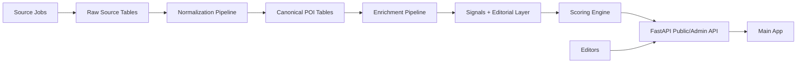

# Technical Specification

## System Overview

The service will be a standalone FastAPI application backed by Postgres + PostGIS, with source-specific ingestion jobs and a route-aware scoring engine.

Core architectural principle:

- scheduled jobs perform slow, messy, source-heavy work
- runtime requests perform fast, bounded, route-aware ranking on already normalized data

## Recommended Repository Shape

```text
poi-curator/
  apps/
    api/
    admin/                    # optional lightweight review UI later
  packages/
    domain/                   # models, enums, taxonomy, contracts
    ingestion/                # source adapters and normalization
    enrichment/               # Wikidata/Wikipedia/heritage joins
    scoring/                  # rule engine and explanations
    editorial/                # overrides, packs, moderation logic
  infra/
    docker/
    sql/
  tests/
    unit/
    integration/
    golden_routes/
    fixtures/
  docs/
    planning/
```

This keeps the API thin and protects the domain model from becoming a pile of endpoint code.

## Runtime Architecture



## Core Components

### 1. Ingestion jobs

Responsibilities:

- fetch source data
- store raw payloads with provenance
- compute content hashes and record freshness
- avoid data loss during source updates

Initial source adapters:

- OSM / Overpass
- NRHP / SHPO import adapter

Design rule:

Each source adapter writes to `poi_source_raw` or adjacent raw staging tables first. No adapter writes directly into `poi`.

### 2. Normalization pipeline

Responsibilities:

- map messy source types into internal taxonomy
- derive canonical names and slugs
- deduplicate overlapping source records
- create canonical POI records plus source links

Key logic:

- normalize geometry type and centroid
- infer region/city assignment
- preserve source-specific tags in a summarized JSON field
- maintain multi-membership across internal categories

### 3. Enrichment pipeline

Responsibilities:

- attach Wikidata identity and class signals
- fetch optional Wikipedia blurbs/extracts
- join official heritage identifiers where possible
- compute derived evidence signals

Matching strategy order:

1. explicit source IDs or tags if available
2. spatial + name similarity
3. spatial-only fallback with low confidence

The pipeline must record confidence and never silently overwrite an existing, higher-confidence identity link.

### 4. Scoring engine

Responsibilities:

- hard-filter route-incompatible candidates
- compute route fit, significance, interpretive value, quality, editorial contribution, and penalties
- emit factor breakdowns and explanation phrases

Implementation rule:

Start with weighted rules and versioned scoring configs. No ML ranking in MVP.

### 5. API layer

Responsibilities:

- validate request shapes
- expose stable public contracts
- expose admin curation and ingestion status endpoints
- avoid embedding complex business logic directly in routers

### 6. Editorial layer

Responsibilities:

- suppression
- featured/pinned boosts
- title and description overrides
- category overrides
- merge decisions and review notes

The editorial layer must be queryable and auditable.

## Data Storage

### Primary store

- Postgres 16
- PostGIS 3.x

### Why PostGIS

- route corridor clipping and proximity scoring are first-class spatial operations
- geometry indexes and `ST_DWithin`/`ST_Distance`/`ST_LineLocatePoint` matter immediately
- relational storage suits editorial state, provenance, and source joins

### Secondary analytical tooling

- DuckDB is acceptable for ad hoc profiling and notebook work
- not acceptable as the primary production store

## Schema

### `poi_source_raw`

One row per imported source object.

Suggested fields:

- `id`
- `source_name`
- `source_record_id`
- `source_url`
- `raw_payload_json`
- `geom`
- `fetched_at`
- `content_hash`
- `is_current`
- `license`
- `ingest_run_id`

Indexes:

- unique composite on `source_name, source_record_id, content_hash`
- GiST on `geom`

### `poi`

Canonical normalized record.

Suggested fields:

- `poi_id` UUID
- `canonical_name`
- `slug`
- `geom`
- `centroid`
- `city`
- `region`
- `country`
- `normalized_category`
- `normalized_subcategory`
- `display_categories` text array
- `short_description`
- `primary_source`
- `osm_id`
- `wikidata_id`
- `wikipedia_title`
- `heritage_id`
- `raw_tag_summary_json`
- `historical_flag`
- `cultural_flag`
- `scenic_flag`
- `infrastructure_flag`
- `food_identity_flag`
- `walk_relevance`
- `drive_relevance`
- `base_significance_score`
- `quality_score`
- `review_status`
- `is_active`
- `created_at`
- `updated_at`

Indexes:

- unique on `slug`
- GiST on `geom`
- btree on `city, region, normalized_category, review_status, is_active`

### `poi_signals`

Derived evidence, recomputable.

Suggested fields:

- `poi_id`
- `source_count`
- `has_wikidata`
- `has_wikipedia`
- `has_official_heritage_match`
- `osm_tag_richness`
- `description_quality`
- `entity_type_confidence`
- `local_identity_score`
- `interpretive_value_score`
- `genericity_penalty`
- `editorial_priority_seed`
- `computed_at`

### `poi_editorial`

Human overrides and review state.

Suggested fields:

- `poi_id`
- `editorial_status`
- `editorial_title_override`
- `editorial_description_override`
- `editorial_category_override`
- `editorial_boost`
- `editorial_notes`
- `city_pack`
- `last_reviewed_at`
- `reviewed_by`

### Recommended supporting tables

- `poi_source_link`: many-to-one mapping from canonical POIs to raw source rows
- `ingest_run`: run metadata, counts, duration, status, error summary
- `poi_merge_log`: duplicate merges and replacement mapping
- `scoring_profile`: weight-set versions by mode and category
- `route_query_log`: optional internal diagnostics for evaluation and QA

## Spatial Query Strategy

### Precompute

- centroid
- simplified geometry
- city/region assignment
- category mappings
- significance and quality sub-scores
- source agreement/confidence
- editorial state

### Compute at request time

- route corridor buffer
- candidate selection within corridor
- distance from route
- estimated detour burden
- budget fit
- final score
- explanation assembly

### Performance rules

1. Keep raw and canonical geometries indexed.
2. Run candidate selection with coarse corridor clipping before deeper scoring.
3. Prefer precomputed candidate features over live external lookups.
4. If route queries get expensive, introduce materialized route-segment helper tables or cache by hashed route geometry.

## Dedupe and Identity Strategy

Canonicalization should not be a single fuzzy-match step. Use layered decisions:

1. Hard link by shared external ID where available.
2. Strong match by name similarity plus small spatial distance plus compatible type.
3. Soft candidate cluster requiring review when type or spatial ambiguity remains.

Do not auto-merge records that represent:

- a district and a monument inside it
- a corridor and a specific mural within it
- a plaza and a museum on the plaza

The dedupe system should prefer false separation over destructive merging in early phases.

## Taxonomy Strategy

### Public categories

- History
- Culture
- Art
- Scenic
- Food
- Civic / Infrastructure

### Internal taxonomy

- `historic_site`
- `historic_district`
- `museum`
- `monument_memorial`
- `mural_public_art`
- `gallery_art_space`
- `performance_cultural_venue`
- `neighborhood_corridor`
- `overlook_vista`
- `trail_river_access`
- `civic_space_plaza`
- `infrastructure_landmark`
- `market_food_identity`
- `ritual_religious_site`
- `landscape_feature`

Implementation detail:

Store internal types as a many-valued field or join table. Do not collapse them into a single enum.

## Scoring Model

### Hard filters

Reject before scoring if:

- outside route corridor buffer
- inactive or suppressed
- below quality threshold
- category mismatch unless mixed-category query
- detour exceeds max budget
- mode relevance too low

### Score formula

```text
score = route_fit + significance + interpretive + record_quality + editorial - penalties
```

Suggested ranges:

- route fit: `0..35`
- significance: `0..25`
- interpretive value: `0..20`
- record quality: `0..10`
- editorial: `-10..20`
- penalties: `0..20`

### Required diagnostics per candidate

- `scoring_profile_version`
- `factor_breakdown_json`
- `why_selected`
- `why_not_selected`
- `detour_metrics`

### Route-mode specialization

Driving profile:

- wider corridor and detour tolerance
- higher tolerance for isolated overlooks or roadside heritage
- stronger emphasis on “worth exiting for”

Walking profile:

- tighter corridor
- heavier route deviation penalties
- stronger preference for plazas, murals, streetscape, civic texture, corridor legibility

## API Design

### Public endpoints

- `GET /v1/health`
- `GET /v1/config`
- `POST /v1/route/suggest`
- `GET /v1/poi/{poi_id}`
- `GET /v1/categories`

### Admin endpoints

- `GET /v1/admin/poi?status=needs_review&city=santa-fe`
- `PATCH /v1/admin/poi/{poi_id}`
- `POST /v1/admin/ingest/run`
- `GET /v1/admin/ingest/status`

### API contract rules

1. Return top N alternatives, not just one choice.
2. Keep public fields concise and stable.
3. Put experimental diagnostics behind admin or debug flags.
4. Version scoring weights separately from API versioning.

## Job Orchestration

### MVP recommendation

- implement ingestion and enrichment as explicit CLI jobs
- trigger them from external cron or CI scheduler
- record each run in `ingest_run`

Why:

- simpler than embedding a scheduler inside the API app
- easier to reason about failures and retries
- keeps web lifecycle separate from long-running data pulls

### Later if needed

Move to a real workflow engine only when:

- sources multiply
- retries become complex
- backfills require orchestration across regions

## Deployment Shape

### MVP

- one API container
- one jobs container image or command target
- one Postgres/PostGIS instance
- object storage optional for raw payload snapshots if volume grows

### Environments

- `local`
- `staging`
- `production`

### Configuration domains

- source credentials and endpoints
- supported regions
- scoring profile versions
- default detour budgets by mode
- admin auth

## Observability

The service needs normal app telemetry plus ranking telemetry.

### Required

- structured logs
- ingest run status and counts
- API latency and error rates
- scoring profile version on every route result
- candidate counts before and after hard filters

### Strongly recommended

- tracing for ingestion pipeline stages
- slow spatial query logging
- admin audit trail for overrides

## Testing Strategy

### Unit tests

- taxonomy mapping
- score component math
- explanation phrase assembly
- dedupe heuristics

### Integration tests

- PostGIS-backed spatial queries
- route corridor filtering
- ingestion into raw and canonical tables
- admin override persistence

### Golden-route tests

Create a fixed set of Santa Fe route fixtures with expected acceptable results and unacceptable false positives. Use these to gate scoring changes.

### Source fixture tests

Keep representative OSM, Wikidata, Wikipedia, and heritage payload fixtures to test normalization without repeated live calls.

## Security and Governance

- Admin endpoints require authentication and role gating.
- Raw payload provenance must be retained for auditability.
- Source license fields should be stored and documented.
- Editorial text should avoid unsupported historical claims not grounded in source evidence or review.

## Strategic Future Extensions

- corridor-level diversity constraints so results do not cluster semantically
- cached route segment fingerprints for common paths
- second-city portability framework after Santa Fe stabilizes
- experimental LLM assistance only for draft editorial blurbs or review triage, never as the first ranking authority
